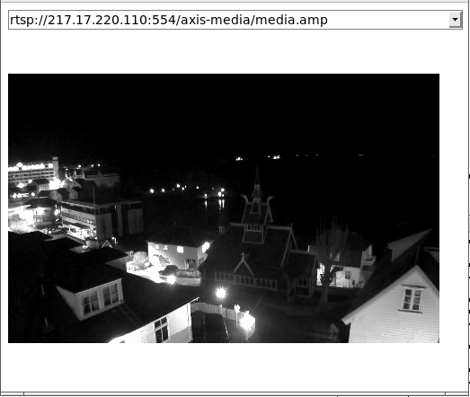

WebRTC-streamer
===============

This is a try to stream video sources through WebRTC using simple mechanism.  

It embeds a HTTP server that implements API and serve a simple HTML page that use them through AJAX.   

The WebRTC signaling is implemented throught HTTP requests:

 - /call   : send offer and get answer
 - /hangup : close a call

 - /addIceCandidate : add a candidate
 - /getIceCandidate : get the list of candidates

The list of HTTP API is available using /help.

Nowdays there is 3 builds on [Travis CI](https://travis-ci.org/mpromonet/webrtc-streamer) :
 * for x86_64 on Ubuntu Xenial
 * for armv7 crosscompiling with gcc-linaro-arm-linux-gnueabihf-raspbian-x64 (this build is running on Raspberry Pi2 and NanoPi NEO)
 * for armv6+vfp crosscompiling with gcc-linaro-arm-linux-gnueabihf-raspbian-x64 (this build is running on Raspberry PiB and should run on a Raspberry Zero)

Dependencies :
-------------
It is based on :
 * [WebRTC Native Code Package](http://www.webrtc.org)
 * [civetweb HTTP server](https://github.com/civetweb/civetweb)
 * [h264bitstream](https://github.com/aizvorski/h264bitstream)
 * [live555](http://www.live555.com/liveMedia)

Build
===============

Build WebRTC with H264 support
-------
	mkdir ../webrtc
	pushd ../webrtc
	fetch webrtc
	gn gen out/Release --args='is_debug=false use_custom_libcxx=false rtc_use_h264=true ffmpeg_branding="Chrome" rtc_include_tests=false use_ozone=true rtc_include_pulse_audio=false'
	ninja -C out/Release
	popd

Build live555 to enable RTSP support(optional)
-------
	make SYSROOT=<path to WebRTC>/src/build/linux/debian_stretch_amd64-sysroot live555

Build WebRTC Streamer
------- 
	make WEBRTCROOT=<path to WebRTC> WEBRTCBUILD=<Release or Debug> SYSROOT=<path to WebRTC>/src/build/linux/debian_stretch_amd64-sysroot
	
where WEBRTCROOT and WEBRTCBUILD indicate how to point to WebRTC :
 - $WEBRTCROOT/src should contains source (default is ../webrtc) 
 - $WEBRTCROOT/src/out/$WEBRTCBUILD should contains libraries (default is Release)
 - $SYSROOT should point to sysroot used to build WebRTC (default is /)

Usage
===============
	./webrtc-streamer [-H http port] [-S[embeded stun address]] -[v[v]]  [url1]...[urln]
	./webrtc-streamer [-H http port] [-s[external stun address]] -[v[v]] [url1]...[urln]
	./webrtc-streamer -V
         	-H [hostname:]port : HTTP server binding (default 0.0.0.0:8000)
         	-S[stun_address]   : start embeded STUN server bind to address (default 0.0.0.0:3478)
         	-s[stun_address]   : use an external STUN server (default stun.l.google.com:19302)
         	-t[username:password@]turn_address : use an external TURN relay server (default disabled)		
        	-a[audio layer]    : spefify audio capture layer to use (default:3)		
         	[url]              : url to register in the source list
        	-v[v[v]]           : verbosity
        	-V                 : print version

Arguments of '-H' is forwarded to option 'listening_ports' of civetweb, then it is possible to use the civetweb syntax like '-H8000,9000' or '-H8080r,8443'.

Example
-----
	webrtc-streamer rtsp://217.17.220.110/axis-media/media.amp \
				rtsp://85.255.175.241/h264 \
				rtsp://85.255.175.244/h264 \
				rtsp://184.72.239.149/vod/mp4:BigBuckBunny_175k.mov

[Live Demo](https://webrtc-streamer.herokuapp.com/)

You can access to the WebRTC stream coming from an RTSP url using [webrtcstream.html](html/webrtcstream.html) page with the RTSP url as argument, something like:

   https://webrtc-streamer.herokuapp.com/webrtcstream.html?rtsp://217.17.220.110/axis-media/media.amp

Embed in a HTML page:
===============
Instead of using the internal HTTP server, it is easy to display a WebRTC stream in a HTML page served by another HTTP server. The URL of the webrtc-streamer to use should be given creating the [WebRtcStreamer](http://htmlpreview.github.io/?https://github.com/mpromonet/webrtc-streamer/blob/master/jsdoc/WebRtcStreamer.html) instance :

	var webRtcServer      = new WebRtcStreamer(<video tag>, <webrtc-streamer url>, <request interface>);

A short sample HTML page using webrtc-streamer running locally on port 8000 :

	<html>
	<head>
	
	
	
	</head>
	<body> 
	    <video id="video" />
	</body>
	</html>

Connect to Janus Gateway Video Room
===============
A simple way to publish WebRTC stream to a [Janus Gateway](https://janus.conf.meetecho.com) Video Room is to use the [JanusVideoRoom](http://htmlpreview.github.io/?https://github.com/mpromonet/webrtc-streamer/blob/master/jsdoc/JanusVideoRoom.html) interface

        var janus = new JanusVideoRoom(<janus url>, <webrtc-streamer url>, <request interface>)

A short sample to publish WebRTC streams to Janus Video Room could be :

	<html>
	<head>
	
	
	
	</head>
	</html>

[Live Demo](https://webrtc-streamer.herokuapp.com/janusvideoroom.html)

This way the communication between [Janus API](https://janus.conf.meetecho.com/docs/JS.html) and [WebRTC Streamer API](https://webrtc-streamer.herokuapp.com/help) is implemented in Javascript running in browser.

The same logic could be implemented in NodeJS using the same JS API :

	var request = require('then-request');
	var JanusVideoRoom = require('./html/janusvideoroom.js'); 
	var janus = new JanusVideoRoom("http://192.168.0.15:8088/janus", "http://192.168.0.15:8000", request)
	janus.join(1234,"mmal service 16.1","video")

Docker image
===============
You can start the application using the docker image :

        docker run -p 8000:8000 -it mpromonet/webrtc-streamer

You can expose V4L2 devices from your host using :

        docker run --device=/dev/video0 -p 8000:8000 -it mpromonet/webrtc-streamer

The container entry point is the webrtc-streamer application, then you can :

* get the help using :

        docker run -p 8000:8000 -it mpromonet/webrtc-streamer -h

* run the container registering a RTSP url using :

        docker run -p 8000:8000 -it mpromonet/webrtc-streamer -n raspicam -u rtsp://pi2.local:8554/unicast

