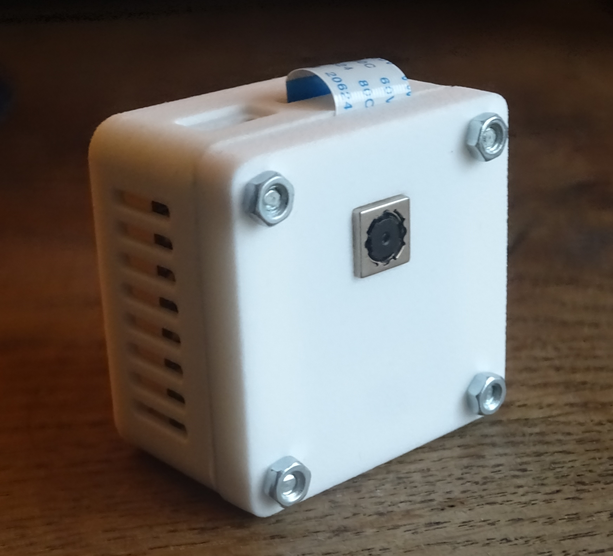
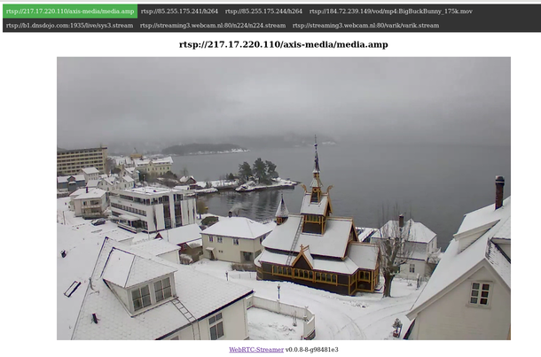
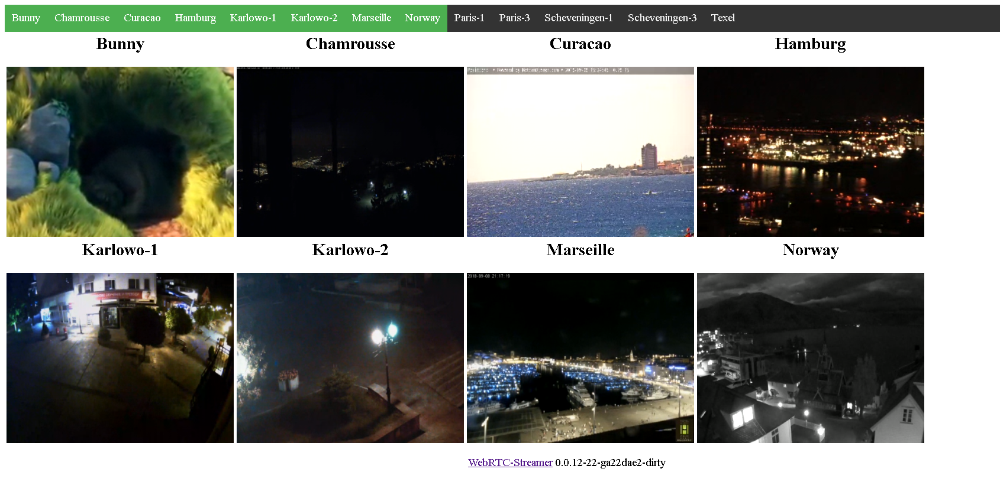
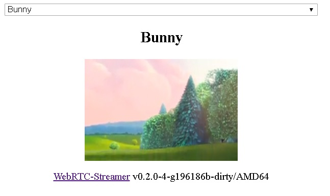
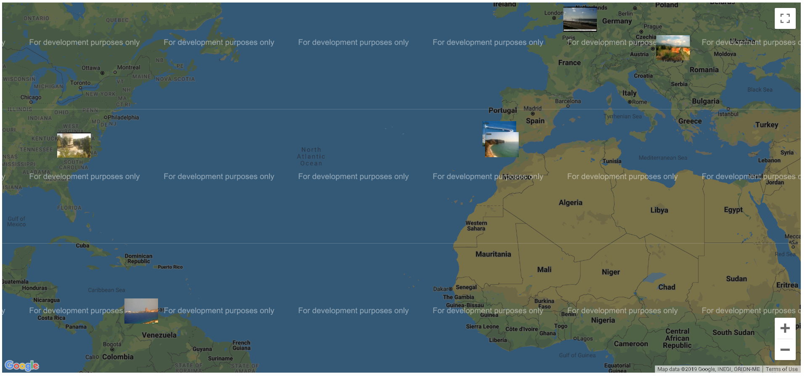
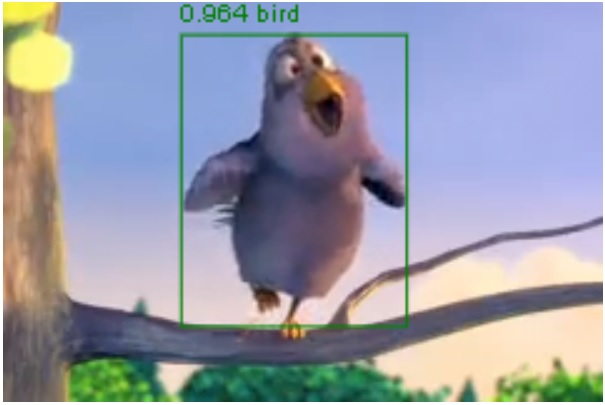
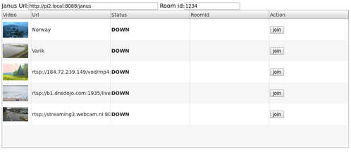

# WebRTC-Streamer
<a href="https://wiki.friendlyelec.com/wiki/index.php/NanoPi_NEO_Air"></a>

[](https://circleci.com/gh/mpromonet/webrtc-streamer)
[](https://cirrus-ci.com/github/mpromonet/webrtc-streamer)
[](https://snapcraft.io/webrtc-streamer)

[](https://github.com/mpromonet/webrtc-streamer/actions/workflows/cpp-linux.yml)
[](https://github.com/mpromonet/webrtc-streamer/actions/workflows/cpp-windows.yml)
[](https://github.com/mpromonet/webrtc-streamer/actions/workflows/cpp-macos.yml)

[](https://github.com/mpromonet/webrtc-streamer/releases/latest)
[](https://github.com/mpromonet/webrtc-streamer/releases/latest)
[](https://hub.docker.com/r/mpromonet/webrtc-streamer/)

[](https://webrtcstreamer.agreeabletree-365b9a90.canadacentral.azurecontainerapps.io/)
[](https://gitpod.io/#https://github.com/mpromonet/webrtc-streamer)


Experimentation to stream WebRTC media sources like capture devices, screen capture, mkv files and RMTP/RTSP sources using simple signaling mechanism (see [api](docs/api.md)). It is also compatible with [WHEP](https://datatracker.ietf.org/doc/html/draft-ietf-wish-whep-01) interface.

*** Notice *** Live demo are stopped till I migrate to a european web hosting.

## Artefacts

* packages are available from https://github.com/mpromonet/webrtc-streamer/releases/latest
* container image are available from  https://hub.docker.com/r/mpromonet/webrtc-streamer


## Usage

```roff
./webrtc-streamer [-H http port] [-S[embeded stun address]] -[v[v]]  [urls...]
./webrtc-streamer [-H http port] [-s[external stun address]] -[v[v]] [urls...]
./webrtc-streamer -V
	-v[v[v]]           : verbosity
	-V                 : print version
	-C config.json                     : load urls from JSON config file 
	-n name -u videourl -U audiourl    : register a name for a video url and an audio url
	[url]                              : url to register in the source list

	-H [hostname:]port : HTTP server binding (default 0.0.0.0:8000)
	-w webroot         : path to get files
	-c sslkeycert      : path to private key and certificate for HTTPS
	-N nbthreads       : number of threads for HTTP server
	-A passwd          : password file for HTTP server access
	-D authDomain      : authentication domain for HTTP server access (default:mydomain.com)

	-S[stun_address]                   : start embeded STUN server bind to address (default 0.0.0.0:3478)
	-s[stun_address]                   : use an external STUN server (default:stun.l.google.com:19302 , -:means no STUN)
	-T[username:password@]turn_address : start embeded TURN server (default:disabled)
	-t[username:password@]turn_address : use an external TURN relay server (default:disabled)
	-R [Udp port range min:max]        : Set the webrtc udp port range (default 0:65535)
	-W webrtc_trials_fields            : Set the webrtc trials fields (default:WebRTC-FrameDropper/Disabled/)		
	-a[audio layer]                    : spefify audio capture layer to use (default:0)		
	-q[filter]                         : spefify publish filter (default:.*)
	-o                                 : use null codec (keep frame encoded)
```

Arguments of '-H' are forwarded to option
[`listening_ports`](https://github.com/civetweb/civetweb/blob/master/docs/UserManual.md#listening_ports-8080)
of civetweb, allowing use of the civetweb syntax like `-H8000,9000` or
`-H8080r,8443s`.

Using `-o` allows storing compressed frame data from the backend stream using
`webrtc::VideoFrameBuffer::Type::kNative`. This hacks the stucture
`webrtc::VideoFrameBuffer` storing data in a override of the i420 buffer. This
allows forwarding H264 frames from V4L2 device or RTSP stream to WebRTC stream.
It uses less CPU, but has less features (resize, codec, and bandwidth are
disabled).

Options for the WebRTC stream name:

- an alias defined using `-n` argument then the corresponding `-u` argument will
  be used to create the capturer
- an "rtsp://" url that will be opened using an RTSP capturer based on live555
- an "file://" url that will be opened using an MKV capturer based on live555
- an "rmtp://" url that will be opened using an RMTP capturer based on librmtp
- an "screen://" url that will be opened by
  `webrtc::DesktopCapturer::CreateScreenCapturer`
- an "window://" url that will be opened by
  `webrtc::DesktopCapturer::CreateWindowCapturer`
- an "v4l2://" url that will capture
  [H264](https://en.wikipedia.org/wiki/Advanced_Video_Coding) frames and store
  it using webrtc::VideoFrameBuffer::Type::kNative type (not supported on
  Windows)
- an "videocap://" url video capture device name
- an "audiocap://" url audio capture device name

#### Examples

```sh
./webrtc-streamer -C config.json
```

[](https://webrtcstreamer.agreeabletree-365b9a90.canadacentral.azurecontainerapps.io/)

[Live Demo](https://webrtcstreamer.agreeabletree-365b9a90.canadacentral.azurecontainerapps.io/)

We can access to the WebRTC stream using
[webrtcstreamer.html](https://github.com/mpromonet/webrtc-streamer-html/blob/master/webrtcstreamer.html).
For instance:

- [webrtcstreamer.html?rtsp://wowzaec2demo.streamlock.net/vod/mp4:BigBuckBunny_115k.mov](https://webrtcstreamer.agreeabletree-365b9a90.canadacentral.azurecontainerapps.io/webrtcstreamer.html?rtsp://wowzaec2demo.streamlock.net/vod/mp4:BigBuckBunny_115k.mov)
- [webrtcstreamer.html?Bunny](https://webrtcstreamer.agreeabletree-365b9a90.canadacentral.azurecontainerapps.io/webrtcstreamer.html?Bunny)

An example displaying grid of WebRTC Streams is available using option
`layout=<lines>x<columns>`
[](https://webrtcstreamer.agreeabletree-365b9a90.canadacentral.azurecontainerapps.io/?layout=2x4)

[Live Demo](https://webrtcstreamer.agreeabletree-365b9a90.canadacentral.azurecontainerapps.io/?layout=2x4)

## Using docker image

You can start the application using the docker image:

```sh
docker run -p 8000:8000 -it mpromonet/webrtc-streamer
```

You can expose V4L2 devices from your host using:

```sh
docker run --device=/dev/video0 -p 8000:8000 -it mpromonet/webrtc-streamer
```

The container entry point is the webrtc-streamer application, then you can:

- view all commands
  ```sh
  docker run -p 8000:8000 -it mpromonet/webrtc-streamer --help
  ```
- run the container registering a RTSP url:

  ```sh
  docker run -p 8000:8000 -it mpromonet/webrtc-streamer -n raspicam -u rtsp://pi2.local:8554/unicast
  ```
- run the container giving config.json file:

  ```sh
  docker run -p 8000:8000 -v $PWD/config.json:/usr/local/share/webrtc-streamer/config.json mpromonet/webrtc-streamer
  ```

## Using embedded STUN/TURN server behind a NAT

It is possible to start an embeded [STUN](https://en.wikipedia.org/wiki/STUN)
and [TURN](https://en.wikipedia.org/wiki/Traversal_Using_Relays_around_NAT)
server and publish its URL:

```sh
./webrtc-streamer -S0.0.0.0:3478 -s$(curl -s ifconfig.me):3478
./webrtc-streamer -s- -T0.0.0.0:3478 -tturn:turn@$(curl -s ifconfig.me):3478
./webrtc-streamer -S0.0.0.0:3478 -s$(curl -s ifconfig.me):3478 -T0.0.0.0:3479 -tturn:turn@$(curl -s ifconfig.me):3479
```

The command `curl -s ifconfig.me` is getting the public IP, it could also given
as a static parameter.

In order to configure the NAT rules using the upnp feature of the router, it is
possible to use
[upnpc](https://manpages.debian.org/unstable/miniupnpc/upnpc.1.en.html) like
this:

```sh
upnpc -r 8000 tcp 3478 tcp 3478 udp
```

Adapting with the HTTP port, STUN port, TURN port.

## HTML Embedding

Instead of using the internal HTTP server, it is easy to display a WebRTC stream
in a HTML page served by another HTTP server. The URL of the WebRTC-streamer to
use should be given creating the
[WebRtcStreamer](http://htmlpreview.github.io/?https://github.com/mpromonet/webrtc-streamer-html/blob/master/jsdoc/WebRtcStreamer.html)
instance:

```js
var webRtcServer = new WebRtcStreamer(<video tag>, <webrtc-streamer url>);
```

A short sample HTML page using webrtc-streamer running locally on port 8000:

```html
<html>
<head>
<script src="libs/adapter.min.js" ></script>
<script src="webrtcstreamer.js" ></script>
<script>        
	var webRtcServer      = null;
	window.onload         = function() { 
		webRtcServer      = new WebRtcStreamer("video",location.protocol+"//"+location.hostname+":8000");
		webRtcServer.connect("rtsp://wowzaec2demo.streamlock.net/vod/mp4:BigBuckBunny_115k.mov");
	}
	window.onbeforeunload = function() { webRtcServer.disconnect(); }
</script>
</head>
<body> 
	<video id="video" />
</body>
</html>
```

## Using WebComponents

WebRTC-streamer provides its own
[Web Components](https://www.webcomponents.org/) as an alternative way to
display a WebRTC stream in an HTML page. For example:

```html
<html>
<head>
	<script type="module" src="webrtc-streamer-element.js"></script>
</head>
<body>
	<webrtc-streamer url="rtsp://wowzaec2demo.streamlock.net/vod/mp4:BigBuckBunny_115k.mov"></webrtc-streamer>
</body>
</html>
```

[Live Demo](https://webrtcstreamer.agreeabletree-365b9a90.canadacentral.azurecontainerapps.io/Bunny.html)

Using the webcomponent with a stream selector:

[](https://webrtcstreamer.agreeabletree-365b9a90.canadacentral.azurecontainerapps.io/webrtc-streamer-element.html)

[Live Demo](https://webrtcstreamer.agreeabletree-365b9a90.canadacentral.azurecontainerapps.io/webrtc-streamer-element.html)

Using the webcomponent over google map:

[](https://webrtcstreamer.agreeabletree-365b9a90.canadacentral.azurecontainerapps.io/map.html)

[Live Demo](https://webrtcstreamer.agreeabletree-365b9a90.canadacentral.azurecontainerapps.io/map.html)

## Using WHEP

It allow to stream using draft standard [WHEP](https://datatracker.ietf.org/doc/html/draft-ietf-wish-whep-01)

[WebRTC player](https://github.com/Eyevinn/webrtc-player) can display WebRTC stream from webrtc-streamer.

A minimal example:
```html
<html>
<head>
    <script src="https://unpkg.com/@eyevinn/whep-video-component@latest/dist/whep-video.component.js"></script>
</head>
<body>
    <whep-video id="video" muted autoplay></whep-video>
    <script>
        video.setAttribute('src', `${location.origin}/api/whep?url=Asahi&options=rtptransport%3dtcp%26timeout%3d60`);
    </script>
</body>
</html>
```
[Live Demo](https://webrtc-streamer-whep.pages.dev/)


## Object detection using tensorflow.js

[](https://webrtcstreamer.agreeabletree-365b9a90.canadacentral.azurecontainerapps.io/tensorflow.html)

[Live Demo](https://webrtcstreamer.agreeabletree-365b9a90.canadacentral.azurecontainerapps.io/tensorflow.html)

## Connect to Janus Gateway Video Room

A simple way to publish WebRTC stream to a
[Janus Gateway](https://janus.conf.meetecho.com) Video Room is to use the
[JanusVideoRoom](http://htmlpreview.github.io/?https://github.com/mpromonet/webrtc-streamer-html/blob/master/jsdoc/JanusVideoRoom.html)
interface

```js
var janus = new JanusVideoRoom(<janus url>, <webrtc-streamer url>)
```

A short sample to publish WebRTC streams to Janus Video Room could be:

```html
<html>
<head>
<script src="janusvideoroom.js" ></script>
<script>        
	var janus = new JanusVideoRoom("https://janus.conf.meetecho.com/janus", null);
	janus.join(1234, "rtsp://pi2.local:8554/unicast","pi2");
	janus.join(1234, "rtsp://wowzaec2demo.streamlock.net/vod/mp4:BigBuckBunny_115k.mov","media");	    
</script>
</head>
</html>
```

[](https://webrtcstreamer.agreeabletree-365b9a90.canadacentral.azurecontainerapps.io/janusvideoroom.html)

[Live Demo](https://webrtcstreamer.agreeabletree-365b9a90.canadacentral.azurecontainerapps.io/janusvideoroom.html)

This way the communication between
[Janus API](https://janus.conf.meetecho.com/docs/JS.html) and
[WebRTC Streamer API](https://webrtcstreamer.agreeabletree-365b9a90.canadacentral.azurecontainerapps.io/help)
is implemented in Javascript running in browser.

The same logic could be implemented in NodeJS using the same JS API:

```js
global.request = require("then-request");
var JanusVideoRoom = require("./html/janusvideoroom.js");
var janus = new JanusVideoRoom(
  "http://192.168.0.15:8088/janus",
  "http://192.168.0.15:8000",
);
janus.join(1234, "videocap://0", "video");
```

## Connect to Jitsi

A simple way to publish WebRTC stream to a [Jitsi](https://meet.jit.si) Video
Room is to use the
[XMPPVideoRoom](http://htmlpreview.github.io/?https://github.com/mpromonet/webrtc-streamer-html/blob/master/jsdoc/XMPPVideoRoom.html)
interface

```js
var xmpp = new XMPPVideoRoom(<xmpp server url>, <webrtc-streamer url>)
```

A short sample to publish WebRTC streams to a Jitsi Video Room could be:

```html
<html>
<head>
<script src="libs/strophe.min.js" ></script>
<script src="libs/strophe.muc.min.js" ></script>
<script src="libs/strophe.disco.min.js" ></script>
<script src="libs/strophe.jingle.sdp.js"></script>
<script src="libs/jquery-3.5.1.min.js"></script>
<script src="xmppvideoroom.js" ></script>
<script>        
	var xmpp = new XMPPVideoRoom("meet.jit.si", null);
	xmpp.join("testroom", "rtsp://wowzaec2demo.streamlock.net/vod/mp4:BigBuckBunny_115k.mov","Bunny");	    
</script>
</head>
</html>
```

[Live Demo](https://webrtcstreamer.agreeabletree-365b9a90.canadacentral.azurecontainerapps.io/xmppvideoroom.html)

## Dependencies

This package depends on the following packages:

- [WebRTC Native Code Package](http://www.webrtc.org) for WebRTC (see license https://webrtc.github.io/webrtc-org/license)
- [civetweb HTTP server](https://github.com/civetweb/civetweb) for HTTP server (see license https://github.com/civetweb/civetweb/blob/master/LICENSE.md)
- [live555](http://www.live555.com/liveMedia) for RTSP/MKV source (see license http://www.live555.com/liveMedia/faq.html#copyright-and-license)

## Build

The following steps are required to build the project, and will install the
dependencies above:

1. Install the Chromium depot tools

   ```sh
   pushd ..
   git clone https://chromium.googlesource.com/chromium/tools/depot_tools.git
   export PATH=$PATH:`realpath depot_tools`
   popd
   ```
2. Download WebRTC

   ```sh
   mkdir ../webrtc
   pushd ../webrtc
   fetch webrtc 
   popd
   ```

3. Build WebRTC Streamer

   ```sh
   cmake . && make
   ```

It is possible to specify cmake parameters `WEBRTCROOT` &
`WEBRTCDESKTOPCAPTURE`:

- `$WEBRTCROOT/src` should contains source (default is $(pwd)/../webrtc)
- `WEBRTCDESKTOPCAPTURE` enabling desktop capture if available (default is ON)


## Pipelines

There is pipelines on [CircleCI](https://circleci.com/gh/mpromonet/webrtc-streamer),
[CirrusCI](https://cirrus-ci.com/github/mpromonet/webrtc-streamer), or
[GitHub CI](https://github.com/mpromonet/webrtc-streamer/actions), for the
following architectures:

- x86_64 on Ubuntu
- armv7 crosscompiled (this build is running on Raspberry Pi2 and NanoPi NEO)
- armv6+vfp crosscompiled (this build is running on Raspberry PiB and should run
  on a Raspberry Zero)
- arm64 crosscompiled
- Windows x64 build with clang
- MacOS


## Star History

[](https://star-history.com/#mpromonet/webrtc-streamer&Date)
