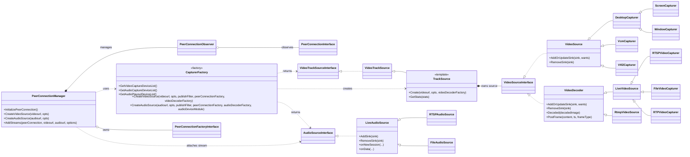

# webrtc-streamer class diagram

```mermaid
classDiagram
	direction LR

	class CapturerFactory {
		<<factory>>
		+GetVideoCaptureDeviceList()
		+GetAudioCaptureDeviceList()
		+GetAudioPlayoutDeviceList()
		+CreateVideoSource(videourl, opts, publishFilter, peerConnectionFactory, videoDecoderFactory)
		+CreateAudioSource(audiourl, opts, publishFilter, peerConnectionFactory, audioDecoderFactory, audioDeviceModule)
	}

	class PeerConnectionManager {
		+InitializePeerConnection()
		+CreateVideoSource(videourl, opts)
		+CreateAudioSource(audiourl, opts)
		+AddStreams(peerConnection, videourl, audiourl, options)
	}

	class PeerConnectionObserver
	class PeerConnectionFactoryInterface
	class PeerConnectionInterface

	%% VIDEO SIDE
	class VideoTrackSourceInterface
	class VideoTrackSource
	class VideoSourceInterfaceFrame

	class TrackSource {
		<<template>>
		+Create(videourl, opts, videoDecoderFactory)
		+GetStats(stats)
	}

	class VideoSource {
		+AddOrUpdateSink(sink, wants)
		+RemoveSink(sink)
	}

	class VideoDecoder {
		+AddOrUpdateSink(sink, wants)
		+RemoveSink(sink)
		+Decoded(decodedImage)
		+PostFrame(content, ts, frameType)
	}

	class DesktopCapturer
	class ScreenCapturer
	class WindowCapturer
	class VcmCapturer
	class V4l2Capturer
	class LiveVideoSource
	class RTSPVideoCapturer
	class FileVideoCapturer
	class RTPVideoCapturer
	class RtmpVideoSource

	VideoTrackSourceInterface <|.. VideoTrackSource
	VideoTrackSource <|-- TrackSource
	VideoSourceInterfaceFrame <|.. VideoSource
	VideoSourceInterfaceFrame <|.. VideoDecoder
	VideoSource <|-- DesktopCapturer
	DesktopCapturer <|-- ScreenCapturer
	DesktopCapturer <|-- WindowCapturer
	VideoSource <|-- VcmCapturer
	VideoSource <|-- V4l2Capturer
	VideoDecoder <|-- LiveVideoSource
	LiveVideoSource <|-- RTSPVideoCapturer
	LiveVideoSource <|-- FileVideoCapturer
	LiveVideoSource <|-- RTPVideoCapturer
	VideoDecoder <|-- RtmpVideoSource

	%% AUDIO SIDE
	class AudioSourceInterface
	class LiveAudioSource {
		+AddSink(sink)
		+RemoveSink(sink)
		+onNewSession(...)
		+onData(...)
	}
	class RTSPAudioSource
	class FileAudioSource

	AudioSourceInterface <|.. LiveAudioSource
	LiveAudioSource <|-- RTSPAudioSource
	LiveAudioSource <|-- FileAudioSource

	PeerConnectionManager o-- PeerConnectionFactoryInterface : owns
	PeerConnectionManager *-- PeerConnectionObserver : manages
	PeerConnectionObserver o-- PeerConnectionInterface : observes
	PeerConnectionManager ..> CapturerFactory : uses

	CapturerFactory ..> TrackSource : creates
	TrackSource *-- VideoSourceInterfaceFrame : owns source
	CapturerFactory ..> VideoTrackSourceInterface : returns
	CapturerFactory ..> AudioSourceInterface : returns
	PeerConnectionManager ..> AudioSourceInterface : attaches stream

	class VideoSourceInterfaceFrame["VideoSourceInterface<VideoFrame>"]
```
